# NovaDrive Motors - Podręcznik Użytkownika

Ten podręcznik zawiera instrukcje krok po kroku dotyczące korzystania z platformy aukcyjnej NovaDrive Motors. Postępuj zgodnie z tymi przewodnikami, aby nauczyć się licytować pojazdy, zarządzać aukcjami i korzystać z funkcji administracyjnych.

---

## Spis Treści

1. [Rozpoczęcie Pracy](#rozpoczęcie-pracy)
2. [Jak Licytować Pojazdy](#jak-licytować-pojazdy)
3. [Jak Tworzyć i Zarządzać Aukcjami](#jak-tworzyć-i-zarządzać-aukcjami)
4. [Przewodnik Administratora](#przewodnik-administratora)
5. [System Importu i Scrapingu](#system-importu-i-scrapingu)

---

## Rozpoczęcie Pracy

### Dostęp do Platformy

Przejdź na stronę NovaDrive Motors, aby uzyskać dostęp do strony głównej.

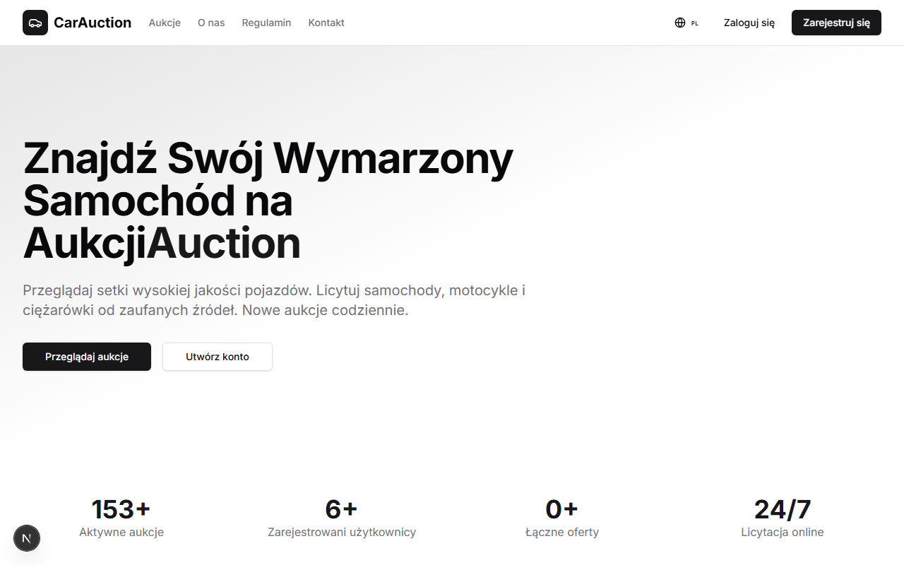

Strona główna wyświetla:
- **Sekcja Hero**: Główne wezwanie do działania z przyciskami "Przeglądaj Aukcje" i "Utwórz Konto"
- **Statystyki**: Liczniki aktywnych aukcji, użytkowników i ofert na żywo
- **Wyróżnione Aukcje**: Pojazdy kończące się wkrótce
- **Sekcja Korzyści**: Dlaczego warto wybrać NovaDrive Motors

### Tworzenie Konta

Kliknij "Rejestracja" w nawigacji lub "Utwórz Konto" na stronie głównej.

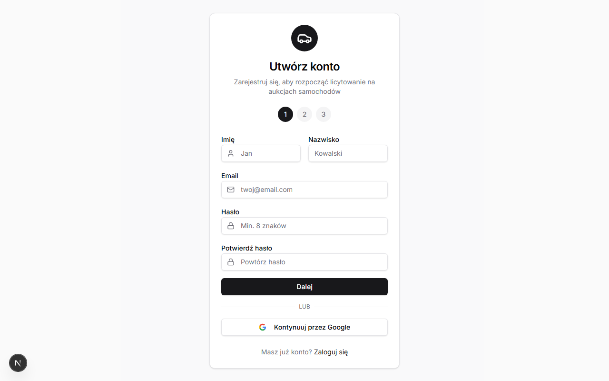

**Krok 1: Dane Osobowe**
1. Wprowadź swoje **Imię** (minimum 2 znaki)
2. Wprowadź swoje **Nazwisko** (minimum 2 znaki)
3. Wprowadź swój **Adres Email** (będzie to Twój login)
4. Utwórz **Hasło** (minimum 8 znaków)
5. **Potwierdź Hasło** wpisując je ponownie

**Krok 2: Weryfikacja**
1. Wprowadź swój **Numer PESEL** (11 cyfr)
2. Wprowadź swój **Numer Telefonu** (minimum 9 cyfr)

**Krok 3: Adres (Opcjonalnie)**
1. Wprowadź swoją **Ulicę**
2. Wprowadź **Miasto**
3. Wprowadź **Kod Pocztowy**

Kliknij **Utwórz Konto**, aby zakończyć rejestrację.

> **Wskazówka**: Możesz również szybko zarejestrować się za pomocą opcji "Kontynuuj z Google".

### Logowanie

Kliknij "Zaloguj się" w menu nawigacji.

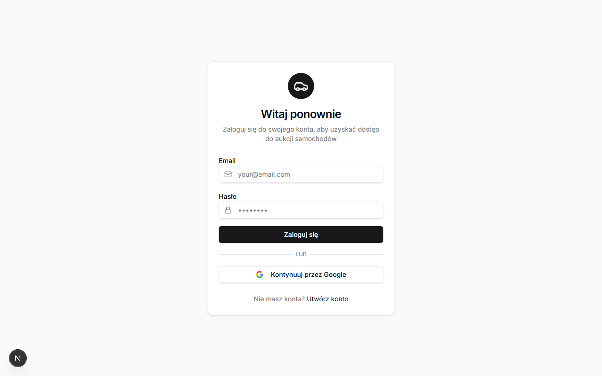

**Aby się zalogować:**
1. Wprowadź swój zarejestrowany **Adres Email**
2. Wprowadź swoje **Hasło**
3. Kliknij **Zaloguj się**

**Alternatywa**: Kliknij "Kontynuuj z Google", aby zalogować się za pomocą konta Google.

---

## Jak Licytować Pojazdy

### Krok 1: Przeglądaj Dostępne Aukcje

Przejdź do strony **Aukcje** z głównego menu.

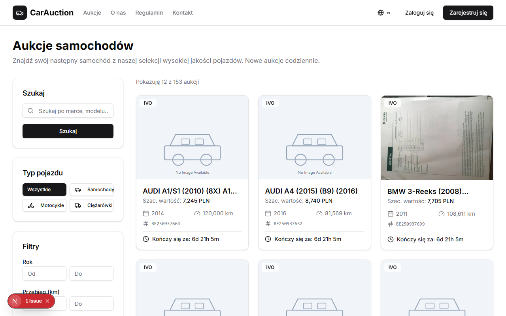

**Korzystanie z Filtrów:**
- **Pole Wyszukiwania**: Wpisz słowa kluczowe (marka, model lub tytuł)
- **Zakładki Typu Pojazdu**: Filtruj według Samochody, Motocykle, Ciężarówki lub Wszystkie
- **Zakres Lat**: Ustaw minimalny i maksymalny rok
- **Zakres Przebiegu**: Filtruj według kilometrów
- **Opcje Sortowania**:
  - Kończące się Wkrótce (domyślnie)
  - Najnowsze
  - Najpopularniejsze

**Czytanie Kart Aukcji:**
Każda karta pokazuje:
- Zdjęcie pojazdu
- Tytuł z marką i modelem
- Rok i przebieg
- Numer referencyjny
- Znacznik typu źródła
- Pozostały czas
- Szacunkowa wartość

### Krok 2: Zobacz Szczegóły Aukcji

Kliknij na dowolną kartę aukcji, aby zobaczyć pełne szczegóły.

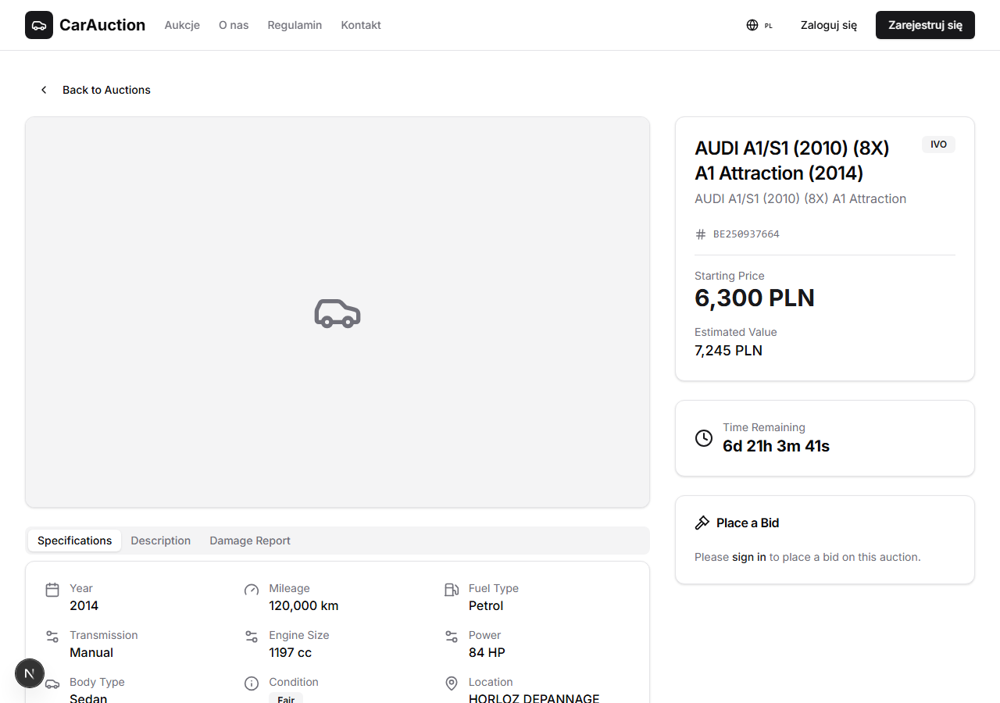

**Galeria Zdjęć (Lewa Strona):**
- Główny widok zdjęcia
- Strzałki nawigacji do przeglądania zdjęć
- Pasek miniatur na dole
- Kliknij dowolną miniaturę, aby wyświetlić to zdjęcie

**Zakładki Informacji:**
1. **Zakładka Specyfikacji**
   - Rok, Przebieg, Rodzaj Paliwa
   - Szczegóły silnika (pojemność, moc)
   - Typ skrzyni biegów
   - Typ nadwozia i kolor
   - Ocena stanu
   - Lokalizacja
   - Numer VIN (dla zweryfikowanych użytkowników)

2. **Zakładka Opisu**
   - Pełny opis pojazdu
   - Lista wyposażenia
   - Specjalne cechy

3. **Zakładka Raportu Uszkodzeń**
   - Ocena uszkodzeń (jeśli dotyczy)
   - Szacunkowy koszt naprawy
   - Uwagi dotyczące stanu

**Panel Aukcji (Prawa Strona):**
- Cena wywoławcza
- Szacunkowa wartość rynkowa
- Odliczanie na żywo
- Twoja aktualna oferta (jeśli jest)
- Pole wprowadzania oferty

### Krok 3: Złóż Swoją Ofertę

**Wymagania:**
- Musisz być zalogowany
- Aukcja musi być aktywna
- Twoja oferta musi spełniać minimalne wymagania

**Aby złożyć ofertę:**

1. **Upewnij się, że jesteś zalogowany** - Jeśli nie, zobaczysz monit o zalogowanie

2. **Wprowadź kwotę oferty** w polu oferty
   - Pierwsza oferta: Musi być równa lub wyższa od ceny wywoławczej
   - Aktualizacja oferty: Musi być o co najmniej 100 PLN wyższa od poprzedniej oferty

3. **Kliknij "Złóż Ofertę"** lub "Aktualizuj Ofertę"

4. **Potwierdź** gdy pojawi się monit

5. **Sprawdź potwierdzenie** - Otrzymasz:
   - Komunikat o sukcesie na ekranie
   - Potwierdzenie emailem

**Wymagania Dotyczące Przyrostu Oferty:**

| Zakres Aktualnej Ceny | Minimalny Przyrost |
|----------------------|-------------------|
| Do 10 000 PLN | 100 PLN |
| 10 001 - 50 000 PLN | 250 PLN |
| 50 001 - 100 000 PLN | 500 PLN |
| Powyżej 100 000 PLN | 1 000 PLN |

### Krok 4: Monitoruj Swoje Oferty

Uzyskaj dostęp do panelu użytkownika, aby śledzić całą swoją aktywność licytacyjną.

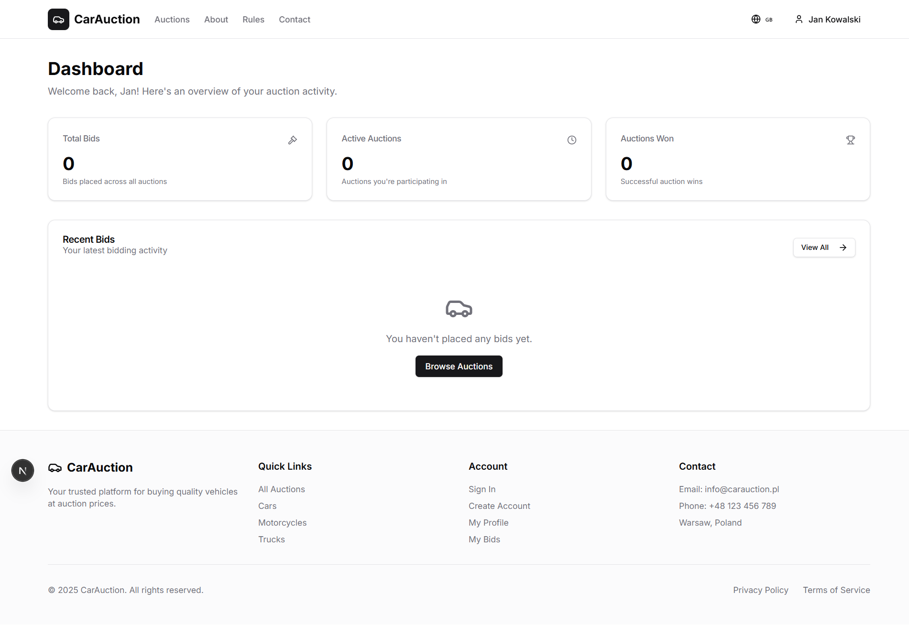

**Panel Pokazuje:**
- **Łączna Liczba Ofert**: Liczba wszystkich złożonych ofert
- **Aktywne Aukcje**: Aukcje, w których obecnie licytujesz
- **Wygrane Aukcje**: Twoje zwycięskie oferty

**Sekcja Ostatnich Ofert:**
- Lista 5 ostatnich ofert
- Pokazuje tytuł aukcji, kwotę i status
- Kliknij "Zobacz Wszystkie" dla pełnej historii

### Zrozumienie Ofert Zamkniętych

NovaDrive Motors używa formatu **aukcji z ofertami zamkniętymi**:

- Kwota Twojej oferty jest **prywatna** - inni licytujący jej nie widzą
- Możesz zobaczyć tylko **swoją własną** ofertę
- Najwyższa oferta wygrywa po zakończeniu aukcji
- Jeśli Twoja oferta jest poniżej ceny minimalnej, pojazd może nie zostać sprzedany

### Wygranie Aukcji

Gdy wygrasz:

1. **Powiadomienie**: Otrzymasz email potwierdzający wygraną

2. **Zadatek (24 godziny)**: Zapłać 10% zwycięskiej oferty, aby zabezpieczyć zakup

3. **Pełna Płatność (5 dni roboczych)**: Dokonaj płatności przelewem bankowym

4. **Odbiór (10 dni roboczych)**: Odbierz pojazd lub zorganizuj dostawę

---

## Jak Tworzyć i Zarządzać Aukcjami

> **Uwaga**: Ta sekcja jest przeznaczona tylko dla administratorów. Musisz mieć uprawnienia administratora, aby uzyskać dostęp do tych funkcji.

### Dostęp do Panelu Administratora

Zaloguj się na konto administratora i przejdź do **Panel Administratora** w menu.

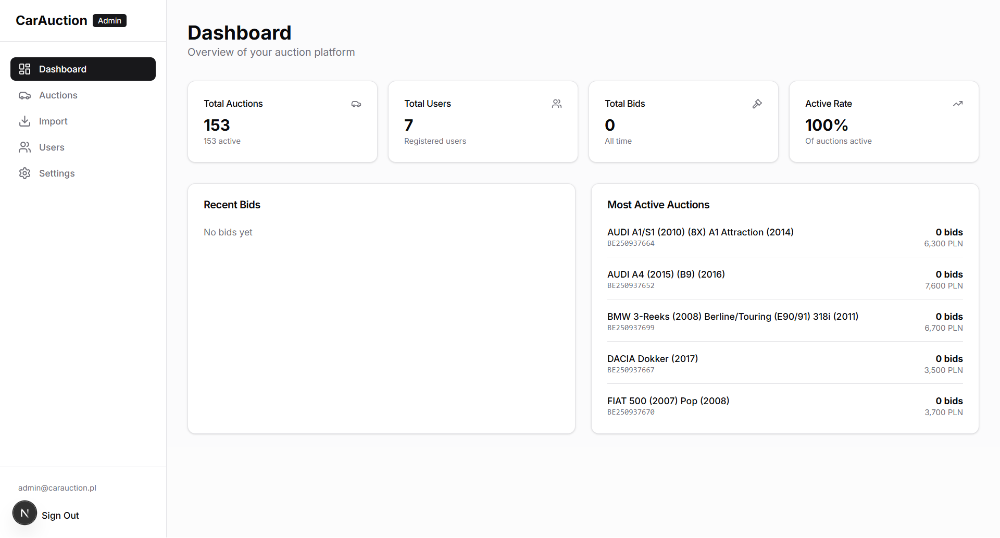

Panel administratora wyświetla:
- **Łączna Liczba Aukcji**: Wszystkie aukcje z liczbą aktywnych
- **Łączna Liczba Użytkowników**: Liczba zarejestrowanych użytkowników
- **Łączna Liczba Ofert**: Liczba wszystkich ofert
- **Wskaźnik Aktywności**: Procent aktywnych aukcji
- **Ostatnie Oferty**: Najnowsza aktywność licytacyjna
- **Najpopularniejsze Aukcje**: Popularne ogłoszenia

### Zarządzanie Istniejącymi Aukcjami

Przejdź do **Admin → Aukcje**.

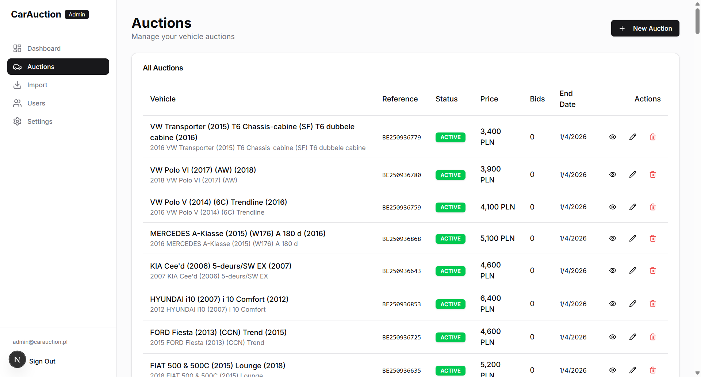

**Kolumny Tabeli Aukcji:**
- Pojazd (zdjęcie i tytuł)
- Numer referencyjny
- Znacznik statusu
- Aktualna cena
- Liczba ofert
- Data zakończenia
- Akcje

**Dostępne Akcje:**
- 👁 **Podgląd**: Otwórz publiczną stronę aukcji
- ✏️ **Edytuj**: Modyfikuj szczegóły aukcji
- 🗑 **Usuń**: Usuń aukcję (tylko jeśli nie ma ofert)

**Kolory Statusów:**
- 🔵 **Wersja Robocza**: Jeszcze nie opublikowana
- 🟢 **Aktywna**: Na żywo, przyjmuje oferty
- 🟡 **Zakończona**: Czas aukcji wygasł
- 🔵 **Sprzedana**: Płatność zakończona
- 🔴 **Anulowana**: Aukcja anulowana

### Tworzenie Nowej Aukcji

Przejdź do **Admin → Aukcje** i kliknij **"Nowa Aukcja"**.

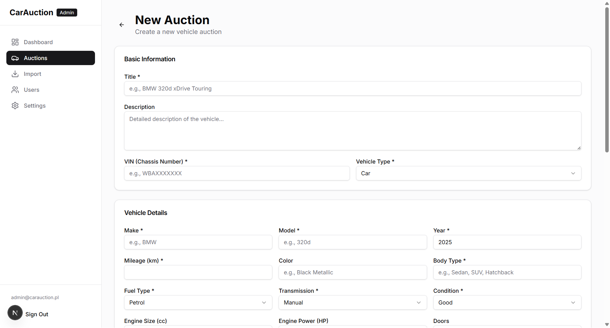

**Karta Podstawowych Informacji:**

| Pole | Wymagane | Opis |
|------|----------|------|
| Tytuł | Tak | Pełna nazwa pojazdu (np. "BMW 320d xDrive 2019") |
| Opis | Nie | Szczegółowy opis pojazdu |
| VIN | Tak | Numer Identyfikacyjny Pojazdu |
| Typ Pojazdu | Tak | Samochód, Motocykl, Ciężarówka lub Inny |

**Karta Szczegółów Pojazdu:**

| Pole | Wymagane | Opis |
|------|----------|------|
| Marka | Tak | Producent (np. BMW, Audi) |
| Model | Tak | Nazwa modelu (np. 320d, A4) |
| Rok | Tak | Rok produkcji (1900 - obecny) |
| Przebieg | Tak | Przejechane kilometry |
| Kolor | Nie | Kolor zewnętrzny |
| Typ Nadwozia | Tak | Sedan, SUV, Hatchback, itp. |
| Rodzaj Paliwa | Tak | Benzyna, Diesel, Elektryczny, Hybryda, LPG, CNG |
| Skrzynia Biegów | Tak | Manualna, Automatyczna, Półautomatyczna |
| Stan | Tak | Od Doskonały do Na Części |
| Pojemność Silnika | Nie | Pojemność w cm³ |
| Moc Silnika | Nie | Moc w KM |
| Liczba Drzwi | Nie | Liczba drzwi (1-6) |
| Lokalizacja | Nie | Miejsce odbioru |

**Karta Cen:**

| Pole | Wymagane | Opis |
|------|----------|------|
| Cena Wywoławcza | Tak | Minimalna oferta otwarcia (PLN) |
| Szacunkowa Wartość | Nie | Oszacowanie wartości rynkowej (PLN) |
| Cena Minimalna | Nie | Minimalna akceptowalna oferta (PLN) |
| Koszt Naprawy | Nie | Szacunkowy koszt naprawy dla uszkodzonych pojazdów |

**Karta Informacji o Uszkodzeniach:**
- Opis Uszkodzeń: Pole tekstowe na szczegółowy raport uszkodzeń
- Istotne tylko dla pojazdów uszkodzonych/na części

**Karta Ustawień Aukcji:**

| Pole | Wymagane | Opcje |
|------|----------|-------|
| Typ Źródła | Tak | Ubezpieczenie, Dealer, Flota, Prywatny, Leasing, Inny |
| Status | Tak | Wersja Robocza, Aktywna, Zakończona, Sprzedana, Anulowana |
| Czas Trwania | Tak (tylko przy tworzeniu) | 1-30 dni |

**Aby utworzyć aukcję:**
1. Wypełnij wszystkie wymagane pola
2. Przejrzyj informacje
3. Ustaw status na "Wersja Robocza", aby zapisać bez publikowania
4. Ustaw status na "Aktywna", aby opublikować natychmiast
5. Kliknij **"Utwórz Aukcję"**

### Edytowanie Aukcji

1. Przejdź do **Admin → Aukcje**
2. Znajdź aukcję na liście
3. Kliknij ikonę **Edytuj** (✏️)
4. Zmodyfikuj dowolne pola
5. Kliknij **"Zaktualizuj Aukcję"**

**Zarządzanie Zdjęciami (Tylko w Trybie Edycji):**
- Przeciągnij i upuść zdjęcia, aby zmienić kolejność
- Pierwsze zdjęcie staje się miniaturą
- Kliknij **"Zapisz Kolejność"**, aby zastosować zmiany

### Zmiana Statusu Aukcji

Aby aktywować, zakończyć lub anulować aukcję:
1. Edytuj aukcję
2. Zmień pole **Status**
3. Zapisz zmiany

**Przejścia Statusów:**
- Wersja Robocza → Aktywna: Publikuje aukcję
- Aktywna → Zakończona: Ręcznie kończy aukcję
- Aktywna → Anulowana: Anuluje aukcję
- Zakończona → Sprzedana: Oznacza jako sprzedaną po płatności

---

## Przewodnik Administratora

### Przegląd Panelu Administratora

Panel administratora zapewnia metryki platformy w czasie rzeczywistym.

**Kluczowe Metryki:**
- **Łączna Liczba Aukcji**: Wszystkie kiedykolwiek utworzone aukcje
- **Liczba Aktywnych**: Obecnie trwające aukcje
- **Łączna Liczba Użytkowników**: Zarejestrowane konta
- **Łączna Liczba Ofert**: Wszystkie złożone oferty
- **Wskaźnik Aktywności**: Procent obecnie aktywnych aukcji

**Kanały Aktywności:**
- Ostatnie oferty ze wszystkich aukcji
- Najpopularniejsze aktywne aukcje

### Zarządzanie Użytkownikami

Przejdź do **Admin → Użytkownicy**.

**Funkcje:**
- Przeglądaj wszystkich zarejestrowanych użytkowników
- Szukaj według imienia lub emaila
- Przeglądaj szczegóły użytkownika i aktywność
- Zarządzaj rolami użytkowników (Użytkownik/Admin)
- Przeglądaj historię ofert użytkownika

### Ustawienia Platformy

Przejdź do **Admin → Ustawienia**.

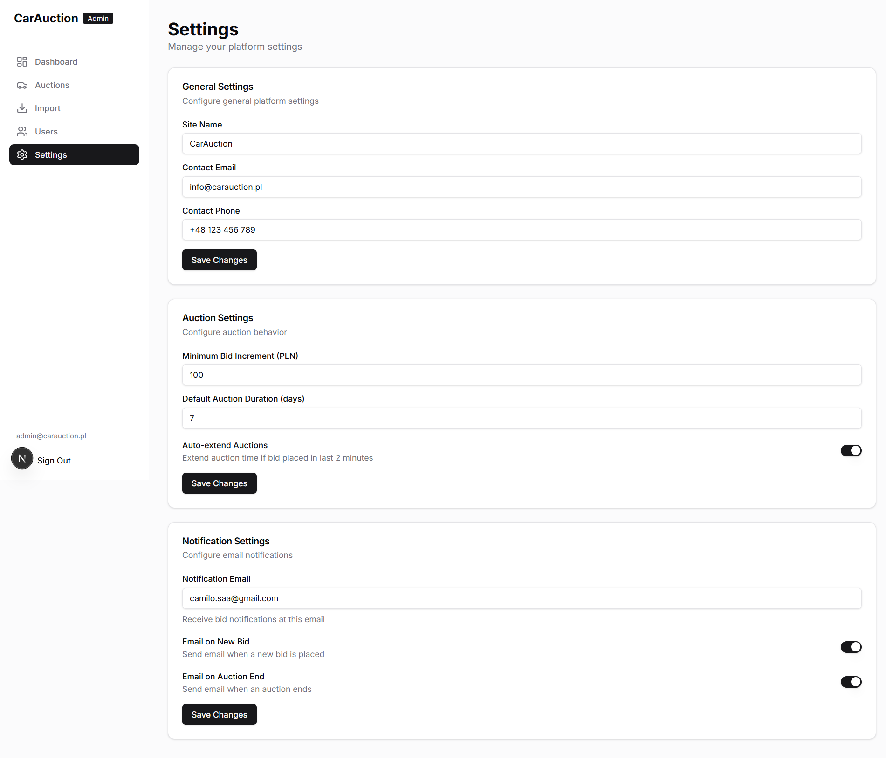

**Ustawienia Ogólne:**
- Nazwa strony
- Email kontaktowy
- Telefon kontaktowy

**Ustawienia Aukcji:**
- Domyślny czas trwania aukcji
- Minimalny przyrost oferty
- Funkcja automatycznego przedłużenia (przedłuża aukcję przy ofercie w ostatnich minutach)

**Ustawienia Powiadomień:**
- Email powiadomień administratora
- Alerty email o nowych ofertach
- Alerty email o zakończeniu aukcji

---

## System Importu i Scrapingu

System importu pozwala administratorom na masowy import pojazdów z zewnętrznych źródeł aukcyjnych.

### Przegląd

Przejdź do **Admin → Import**.

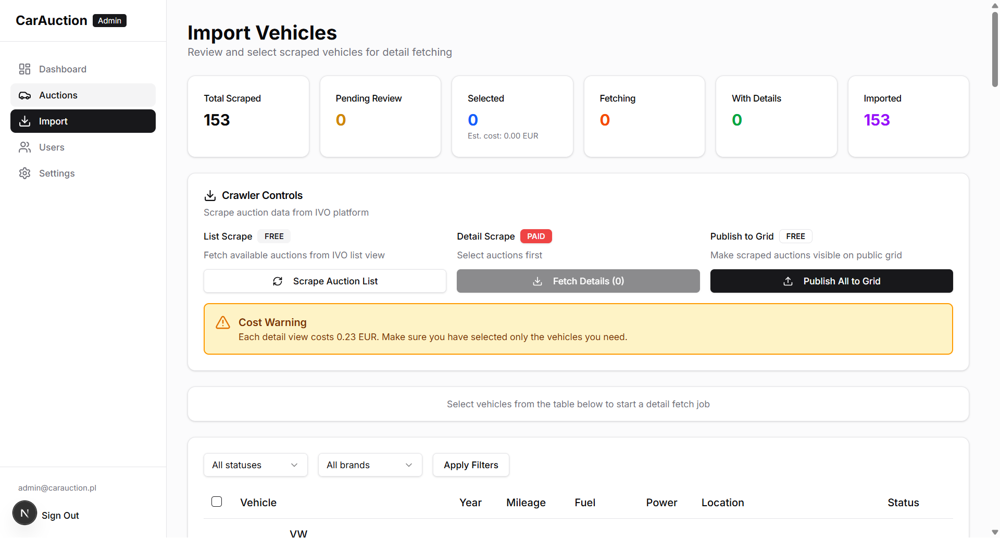

**Karty Statystyk:**
1. **Łącznie Zescrapowane**: Wszystkie pojazdy znalezione przez scraper
2. **Oczekujące na Przegląd**: Czekające na wybór administratora
3. **Wybrane**: Oznaczone do pobrania szczegółów
4. **Pobieranie**: Aktualnie pobierane szczegóły
5. **Ze Szczegółami**: Gotowe do importu
6. **Zaimportowane**: Dodane do głównych aukcji

### Workflow Scrapingu

Proces importu ma trzy główne etapy:

#### Etap 1: Scrapowanie Listy (Bezpłatne)

Scraper automatycznie zbiera podstawowe dane pojazdów ze źródeł zewnętrznych.

**Zbierane Dane (Bez Kosztów):**
- Marka i model
- Rok i przebieg
- Rodzaj paliwa i moc
- Lokalizacja
- Zdjęcie miniaturowe
- Data wygaśnięcia

**Status Pojazdu Po Scrapowaniu:**
- `OCZEKUJĄCY` - Czeka na przegląd

#### Etap 2: Pobieranie Szczegółów (Płatne)

Dla pojazdów, które chcesz zaimportować, pobierz pełne szczegóły.

**Koszt:** 0,23 € za pojazd

**Dodatkowe Pobierane Dane:**
- Numer VIN
- Pełna galeria zdjęć (wszystkie zdjęcia)
- Kompletne specyfikacje
- Szczegółowy raport stanu

**Aby pobrać szczegóły:**
1. Przejrzyj oczekujące pojazdy w tabeli
2. Wybierz pojazdy, które chcesz, klikając pole wyboru
3. Kliknij przycisk **"Pobierz Szczegóły"**
4. Potwierdź szacunkowy koszt
5. Poczekaj na zakończenie pobierania

**Progresja Statusu:**
```
OCZEKUJĄCY → WYBRANY → POBIERANIE → POBRANY
```

#### Etap 3: Import do Aukcji

Przekształć pobrane pojazdy w aktywne aukcje.

**Aby zaimportować:**
1. Przejrzyj pojazdy ze statusem `POBRANY`
2. Kliknij **"Importuj"** dla pojedynczych pojazdów
3. Lub użyj **"Import Zbiorczy"** dla wielu
4. Ustaw ceny i czas trwania
5. Wybierz początkowy status (Wersja Robocza lub Aktywna)

**Status Po Imporcie:**
- `ZAIMPORTOWANY` - Pojazd jest teraz aukcją platformy

### Narzędzia Wyboru

**Opcje Filtrowania:**
- Filtruj według marki
- Filtruj według statusu
- Filtruj według zakresu lat
- Filtruj według zakresu cen

**Akcje Zbiorcze:**
- Zaznacz Wszystkie Widoczne
- Wyczyść Zaznaczenie
- Zaznacz według kryteriów

### Zarządzanie Kosztami

**Śledzenie Kosztów:**
- Zobacz szacunkowy koszt przed pobraniem
- Zobacz rzeczywiste koszty w historii zadań
- Monitoruj wydatki na pojazd

**Najlepsze Praktyki:**
1. Przejrzyj miniatury przed wyborem
2. Sprawdź daty wygaśnięcia
3. Skup się na pojazdach o wysokiej wartości
4. Grupuj podobne pojazdy razem

### Obsługa Błędów

**Możliwe Statusy:**
- `BŁĄD` - Pobieranie nie powiodło się, można ponowić
- `POMINIĘTY` - Ręcznie pominięty przez administratora

**Jeśli pobieranie się nie powiedzie:**
1. Sprawdź komunikat o błędzie
2. Ponów pobieranie
3. Skontaktuj się z pomocą techniczną, jeśli problem się powtarza

---

## Szybka Dokumentacja

### Skróty Klawiszowe

| Akcja | Skrót |
|-------|-------|
| Nawiguj po zdjęciach | ← → strzałki |
| Zamknij modal | Escape |

### Dokumentacja Statusów

**Statusy Aukcji:**
| Status | Można Licytować | Widoczna | Opis |
|--------|----------------|----------|------|
| Wersja Robocza | Nie | Nie | Nie opublikowana |
| Aktywna | Tak | Tak | Aukcja na żywo |
| Zakończona | Nie | Tak | Czas wygasł |
| Sprzedana | Nie | Tak | Płatność zakończona |
| Anulowana | Nie | Nie | Aukcja anulowana |

**Statusy Scrapingu:**
| Status | Znaczenie | Następna Akcja |
|--------|-----------|----------------|
| OCZEKUJĄCY | Czeka na przegląd | Wybierz do pobrania |
| WYBRANY | Oznaczony do pobrania | Czekaj na pobranie |
| POBIERANIE | Pobieranie danych | Czekaj |
| POBRANY | Gotowy do importu | Importuj do aukcji |
| ZAIMPORTOWANY | Jest teraz aukcją | Zakończone |
| POMINIĘTY | Ręcznie pominięty | Brak |
| BŁĄD | Pobieranie nie powiodło się | Ponów |

### Kontakt z Pomocą Techniczną

Jeśli napotkasz problemy:
- **Email**: support@novadrivemotors.pl
- **Telefon**: +48 22 123 45 67
- **Godziny pracy**: Pon-Pt 8:00-18:00, Sob 9:00-14:00

---

*Ostatnia aktualizacja: Grudzień 2024*
*NovaDrive Motors Sp. z o.o.*
